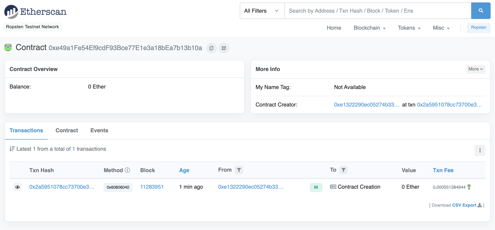
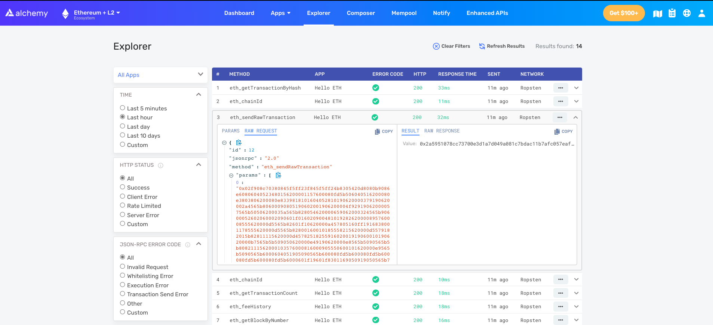

# Hello Ethereum Smart Contract
A simple smart contract of Ethereum blockchain following the [guide](https://ethereum.org/en/developers/tutorials/hello-world-smart-contract)

## Steps
- Connect to Ethereum network using Alchemy - a blockchain developer platform and API that allows us to communicate with the Ethereum chain without having to run our own nodes
- Create an Ethereum account using Metamask wallet
- Create a project using Hardhat - a development environment to compile, deploy, test, and debug your Ethereum software. It helps developers when building smart contracts and dApps locally before deploying to the live chain
- Connect Metamask and Alchemy and update hardhat.config.js file
- Install Ethers.js - a library that makes it easier to interact and make requests to Ethereum by wrapping standard JSON-RPC methods with more user friendly methods
- Compile smart contract
```
npx hardhat compile
```
- Deploy smart contract
```
npx hardhat run scripts/deploy.js --network ropsten
```
Result:
```
Contract deployed to address: 0xe49a1Fe54Ef9cdF93Bce77E1e3a18bEa7b13b10a
```


- Interact with the deployed smart contract: read init message, update message
```
npx hardhat run scripts/interact.js
```
Result:
```
The message is: Hello World!
Updating the message ...
The new message is: This is the new message.
```

# Project Structure
```
- contracts/ smart contract code files
- scripts/ scripts to deploy and interact with our contract
```

